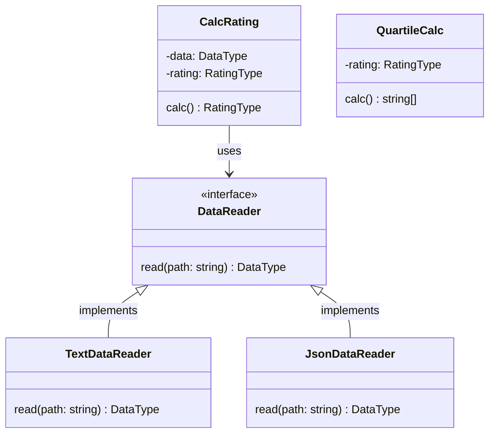

# Лабораторная 1 по дисциплине "Технологии программирования"

## Диаграмма классов

## Описание классов

### DataReader (абстрактный класс)
#### Назначение: 
Определяет интерфейс для чтения данных о студентах и их оценках из разных источников (файлов).
#### Методы:
##### read(path: str) -> DataType: 
Абстрактный метод, который должен быть реализован в подклассах. Принимает путь к файлу данных и возвращает словарь DataType с информацией о студентах и их оценках.

### TextDataReader
#### Назначение: 
Читает данные из текстового файла.
#### Методы:
##### read(path: str) -> DataType: 
Реализует метод read() абстрактного класса DataReader. Парсит текстовый файл и возвращает данные в формате DataType.

### JsonDataReader
#### Назначение: 
Читает данные из JSON файла.
#### Методы:
##### read(path: str) -> DataType: 
Реализует метод read() абстрактного класса DataReader. Парсит JSON файл и возвращает данные в формате DataType, выполняя валидацию структуры данных.

### CalcRating
#### Назначение: 
Вычисляет средний рейтинг каждого студента.
#### Атрибуты:
##### data: DataType: 
Словарь с данными о студентах и их оценках.
##### rating: RatingType: 
Словарь, где ключи - имена студентов, а значения - их средние рейтинги.
#### Методы:
##### calc() -> RatingType: 
Вычисляет средний рейтинг для каждого студента и возвращает словарь RatingType.

### QuartileCalc
#### Назначение: 
Определяет студентов, чей рейтинг попадает в последнюю квартиль.
#### Атрибуты:
##### rating: RatingType: 
Словарь с рейтингами студентов.
#### Методы:

##### calc() -> list[str]: 
Вычисляет последнюю квартиль и возвращает список студентов, чьи рейтинги попадают в неё. Корректно обрабатывает случаи с количеством студентов меньше 4.

## Взаимодействие классов
1. Программа получает путь к файлу и формат данных из аргументов командной строки.
2. Создается экземпляр соответствующего класса DataReader ( TextDataReader или JsonDataReader) в зависимости от формата данных.
3. Вызывается метод read() выбранного DataReader для чтения данных из файла. Результат сохраняется в переменной типа DataType.
4. Создается экземпляр класса CalcRating, которому передаются данные DataType.
5. Вызывается метод calc() класса CalcRating для вычисления рейтинга студентов. Результат сохраняется в переменной типа RatingType.
6. Создается экземпляр класса QuartileCalc, которому передается рейтинг RatingType.
7. Вызывается метод calc() класса QuartileCalc для определения студентов в последней квартили.
8. Программа выводит на экран рейтинг студентов и список студентов, попавших в последнюю квартиль.

## Запуск

`python src/main.py -p <путь_к_файлу> -f <формат>`

## Форматы файлов:

### txt:
Иванов Иван Иванович
	математика:80
	программирование:90
	литература:76
Петров Петр Петрович
	математика:100
	социология:90
	химия:61
### JSON:
{
  "Иванов Иван Иванович": [
    ["математика", 67],
    ["литература", 100],
    ["программирование", 91]
  ],
  "Петров Петр Петрович": [
    ["математика", 78],
    ["химия", 87],
    ["социология", 61]
  ]
}

## Объяснение расчетного задания:

### Рейтинг: 
У вас есть набор студентов, и у каждого студента есть какой-то рейтинг (числовое значение, например, средний балл).
### Распределение по рейтингам: 
Все рейтинги студентов упорядочиваются от меньшего к большему. Это создает распределение рейтингов.
### Квартили: 
Распределение рейтингов делится на четыре равные части. Границы этих частей называются квартилями.

#### Первая квартиль (Q1): 25% студентов имеют рейтинг меньше или равен Q1.
#### Вторая квартиль (Q2, медиана): 50% студентов имеют рейтинг меньше или равен Q2.
#### Третья квартиль (Q3): 75% студентов имеют рейтинг меньше или равен Q3.
#### Последняя квартиль: Это диапазон рейтингов от третьей квартили (Q3) до максимального рейтинга. Другими словами, это верхние 25% рейтингов.

## Пример:

### Допустим, у нас есть следующие рейтинги студентов:

#### Студент A: 60

#### Студент B: 70

#### Студент C: 75

#### Студент D: 80

#### Студент E: 85

#### Студент F: 90

#### Студент G: 95

### Упорядочим рейтинги: 60, 70, 75, 80, 85, 90, 95.

Q1 (первая квартиль) = 70

Q2 (медиана) = 80

Q3 (третья квартиль) = 90

#### Последняя квартиль - это все рейтинги, которые больше или равны 90. В нашем случае это 90 и 95.

Следовательно, студенты, попадающие в последнюю квартиль: Студент F и Студент G.
